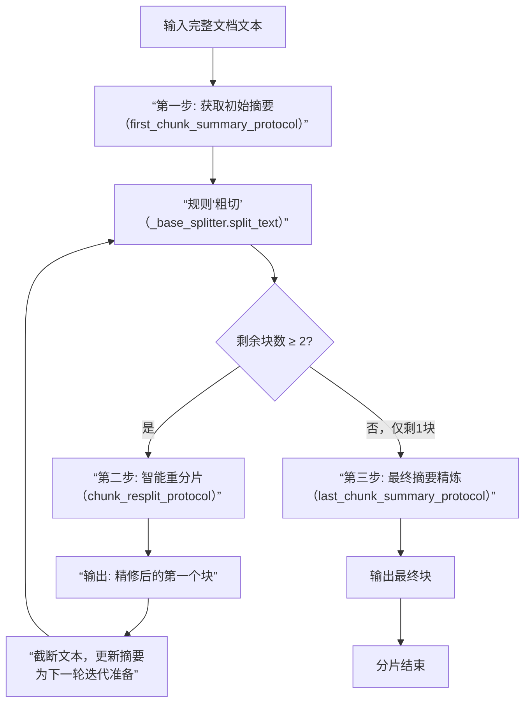

这个 `LLMPoweredRecursiveSplitter` 的设计思想非常巧妙，它创造性地将**基于规则的快速分片**与**基于LLM的语义理解**相结合，旨在解决传统纯规则分片器在复杂文档处理中的根本性难题：无法识别语义边界。

其核心思想是：**先用规则快速“粗切”，再用LLM智能“精修”边界，并通过迭代逐步推进，利用“摘要”维持上下文连贯。**

下面我们来详细拆解它的工作逻辑、设计哲学和最佳应用场景。

### 🔍 分片逻辑：三步迭代算法

整个分片过程可以概括为一个 **“摘要引导的迭代推进”** 算法，主要由三个LLM协议驱动，流程如下图所示：

#### **第一步：获取“前瞻性”初始摘要 (`_get_first_chunk_summary`)**
- **目的**：不是为了直接分片，而是为了理解文档**开头部分**的**核心主旨和潜在延续性**。
- **做法**：先用基础分片器切出第一块，但将**从文档开头到第一块结束**的整个文本送给LLM，要求其生成一个“摘要”。这个摘要不仅总结已读内容，更隐含了对后续内容的预期。

#### **第二步：智能重分片与推进 (`_resplit_chunk_and_generate_summary`) – 核心循环**
- **输入**：剩余全文、当前摘要、由规则分出的前两个块。
- **LLM的决策**：LLM基于对整体语义的理解（承载于`chunk_summary`），判断规则切出的**第一个块的边界是否合理**。它可能：
    1.  **接受当前边界**：确认第一个块是完整的语义单元。
    2.  **调小边界**：第一个块在语义上不完整，需从第二块补入一些内容。
    3.  **调大边界**：第一个块包含了过多内容，应将尾部部分划给第二块。
- **输出**：一个**精修后的、语义完整的第一个块**、该块的**新摘要**、以及用于后续内容的**新摘要**。
- **迭代**：将确定好的第一个块输出，然后**用新的摘要和剩余文本，重复此过程**，直到剩余部分不足两个规则块。

#### **第三步：最终块摘要精炼 (`_get_last_chunk_summary`)**
- 当最后只剩一个块时，用最终的摘要协议进行精炼，确保其摘要能准确反映这个收尾部分在**整个文档上下文**中的角色和内容。

### 🧠 设计思想解析

1.  **混合智能（Hybrid Intelligence）**：
    - **规则分片器（`_base_splitter`）**：负责“机械劳动”，提供初始候选边界，处理长度约束，保证效率。
    - **LLM**：负责“高级判断”，在候选边界上进行语义层面的微调，保证质量。两者分工明确，扬长避短。

2.  **摘要作为“上下文载体”**：
    - 这是最核心的设计。摘要（`chunk_summary`）在迭代中传递，替代了将整个上文重复发送给LLM的高成本做法。它如同一个“记忆胶囊”，压缩了之前已处理内容的核心信息，使LLM在判断当前块边界时，始终保有**全局视角和连贯性**。

3.  **迭代与渐进（Iterative & Progressive）**：
    - 算法不是一次性决定所有边界，而是每次只专注解决**当前最迫切的边界问题**（第一个块去哪结束）。这降低了LLM单次决策的复杂度，也更符合人类阅读和划分章节时的思维方式。

4.  **元数据增强**：
    - 每个输出的文档块都附带了LLM生成的`summary`元数据。这为后续的**检索增强生成（RAG）** 提供了极大便利。检索时不仅可以匹配块内文本，还可以匹配高质量摘要，能显著提升召回率和准确性。

### ⚖️ 应用场景与优劣分析

这种分片器能力强大，但代价也高（LLM调用成本与耗时）。其应用场景非常明确：

| 场景 | 适用性说明 | 与传统分片器对比优势 |
| :--- | :--- | :--- |
| **复杂长文档** （法律合同、学术论文、书籍） | **非常适合**。这类文档结构严谨，逻辑层层递进，语义边界至关重要。 | 能识别“鉴于”条款到“定义”部分的结束，而不是在条款中间切断；能将“研究方法”部分完整保持，不被切到“实验结果”中。 |
| **高价值知识库构建** （用于RAG的精准问答） | **非常适合**。生成的带摘要的块，能极大提升后续检索的准确性和回答的上下文相关性。 | 检索时，查询“违约责任如何界定”能匹配到摘要中包含“违约责任”定义的块，即使块内文本是具体的法律条文。 |
| **格式不规则但内容连贯的文档** （会议纪要、访谈转录、邮件链） | **比较适合**。LLM可以理解对话逻辑和话题转换，进行合理切分。 | 能将一个完整的问答回合保持在一起，而不是按固定行数切分。 |
| **简单、格式规整的文档** （新闻稿、产品说明书、API文档） | **性价比低**。规则分片器（如 `RecursiveCharacterTextSplitter`）已能处理得很好。 | 优势不明显，反而会引入不必要的成本和延迟。 |
| **对处理速度要求极高的流式处理** | **不适用**。LLM调用导致其速度比纯规则分片慢几个数量级。 | 这是为质量而非速度优化的方案。 |

### 📝 总结

**LLMPoweredRecursiveSplitter 是一种“为质量不惜成本”的精英化分片方案**。它通过 **“规则粗切 + LLM精修 + 摘要迭代传递”** 的三段式设计，巧妙地解决了长文档语义分片的经典难题。

- **何时使用**：当你处理的是**高价值、高复杂度**的文档，且后续任务（尤其是RAG）的**效果严重依赖于分片质量**时。
- **何时避免**：当处理**海量简单文档**，或**对处理延迟和成本极其敏感**时。

简而言之，它是将LLM的深度理解能力，精准灌注到了文档预处理流水线中最关键但也最脆弱的环节，是构建高端知识管理系统的利器。