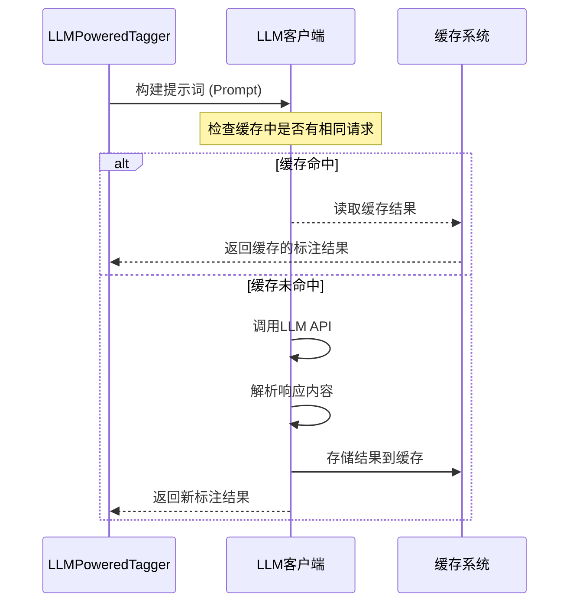

# LLM文档标注原理与应用场景详解

## 一、标注原理举例说明

### 示例1：合同条款分类标注

假设我们需要对法律合同文档进行条款分类：

```python
# 标注协议定义（提示工程）
tagging_prompt = """
请分析以下合同条款内容，判断其属于哪种合同条款类型：
可选类型：["保密条款", "付款条款", "违约责任", "知识产权", "不可抗力", "终止条款"]

条款内容："{clause_text}"

请严格按照以下JSON格式回答：
{
    "条款类型": "选择的类型",
    "置信度": 0-1之间的分数,
    "关键要素": ["提取的关键词列表"]
}
"""

# 输入文档示例
contract_clause = """
双方同意，本合同的任何一方在合同有效期内及合同终止后三年内，
不得向任何第三方披露另一方的商业秘密、技术资料及其他保密信息。
违反本条款的一方应承担违约责任。
"""

# LLM可能返回的标注结果
{
    "条款类型": "保密条款",
    "置信度": 0.95,
    "关键要素": ["商业秘密", "技术资料", "保密信息", "合同终止后三年", "违约责任"]
}
```

### 示例2：医疗记录实体识别

```python
# 医疗实体识别协议
medical_ner_protocol = """
请从以下医疗记录中识别医疗实体：
实体类型：["疾病", "症状", "药物", "检查项目", "身体部位"]

文本："{medical_record}"

请以JSON格式输出：
{
    "实体": [
        {"text": "实体文本", "type": "实体类型", "start": 起始位置, "end": 结束位置}
    ]
}
"""

# 输入示例
medical_text = "患者主诉头痛、发热3天，体温最高39℃，已服用布洛芬，建议明日复查血常规。"

# 标注结果
{
    "实体": [
        {"text": "头痛", "type": "症状", "start": 4, "end": 6},
        {"text": "发热", "type": "症状", "start": 7, "end": 9},
        {"text": "布洛芬", "type": "药物", "start": 25, "end": 28},
        {"text": "血常规", "type": "检查项目", "start": 37, "end": 40}
    ]
}
```

### 示例3：情感分析与观点抽取

```python
# 产品评论分析协议
review_analysis_protocol = """
请分析以下产品评论：
1. 判断整体情感倾向：[积极, 中性, 消极]
2. 提取提到的产品特点
3. 识别用户建议

评论："{review_text}"

输出格式：
{
    "情感倾向": "倾向",
    "情感强度": 1-5分,
    "产品特点": ["特点1", "特点2"],
    "用户建议": ["建议1", "建议2"],
    "问题点": ["问题1", "问题2"]
}
"""
```

## 二、核心处理流程详解

### 1. **标注协议（Prompt Engineering）**
```yaml
# 配置中的标注协议示例
tagging_protocol:
  module_path: "my_protocols.financial_analysis"
  attr_name: "FINANCIAL_ENTITY_PROTOCOL"
```

```python
# my_protocols/financial_analysis.py
FINANCIAL_ENTITY_PROTOCOL = {
    "system_prompt": "你是一个金融文档分析专家",
    "user_template": """
    请从以下金融报告中提取信息：
    1. 公司名称
    2. 财务指标（收入、利润、增长率）
    3. 风险因素
    
    文档内容：{text}
    
    请按以下JSON格式输出：
    {output_format}
    """,
    "output_format": {
        "公司名称": "str",
        "财务指标": {
            "收入": "float",
            "利润": "float",
            "同比增长率": "float"
        },
        "风险因素": ["str"]
    }
}
```

### 2. **LLM交互流程**


## 三、实际应用场景

### 场景1：金融合规文档审查
**问题**：金融机构需要审查大量合同、交易记录是否符合监管要求
**解决方案**：
```yaml
# 配置示例
tagger:
  tag_name: "合规检查"
  tagging_protocol:
    module_path: "compliance.aml_protocol"
    attr_name: "AML_CHECK_PROTOCOL"

input_doc_setting:
  doc_dir: "/data/contracts"
  extensions: [".pdf", ".docx"]

output_doc_setting:
  doc_dir: "/output/compliance_reports"
  suffix: "compliance.json"
```

**标注任务**：
- 识别高风险交易模式
- 检测洗钱嫌疑关键词
- 验证客户身份信息一致性

### 场景2：学术文献元数据抽取
**问题**：科研机构需要从大量论文中抽取结构化信息
**解决方案**：
```python
# 学术论文标注协议
RESEARCH_PAPER_PROTOCOL = """
请从以下学术论文摘要中提取信息：
1. 研究问题
2. 研究方法
3. 主要结论
4. 关键词（5-8个）
5. 所属学科领域

摘要：{abstract}

请按以下JSON格式输出：
{
    "研究问题": "描述",
    "研究方法": ["方法1", "方法2"],
    "主要结论": "结论描述",
    "关键词": ["关键词1", "关键词2"],
    "学科领域": ["领域1", "领域2"],
    "创新点": "创新性描述"
}
"""
```

### 场景3：客服对话分析
**问题**：电商平台需要分析客服对话以改进服务质量
**解决方案**：
```yaml
# 客服对话分析配置
experiment_name: "客服对话情感分析"
tagger:
  tag_name: "对话质量"
  num_parallel: 10  # 并行处理多个对话

input_doc_setting:
  doc_dir: "/data/customer_service/chats"
  extensions: [".json"]

ori_doc_loading:
  module: "chat_loaders.wechat_loader"
  name: "load_chat_messages"
```

**标注维度**：
- 客户情绪变化轨迹
- 客服响应时效性评分
- 问题解决是否彻底
- 客户满意度预测

### 场景4：法律文档比对分析
**问题**：律所需要对比不同版本合同的差异并识别风险
**解决方案**：
```python
# 法律文档比对协议
CONTRACT_COMPARE_PROTOCOL = """
请对比以下两个合同版本，识别：
1. 新增的条款及风险评估
2. 删除的条款及影响分析
3. 修改的条款及法律影响

旧版本：{old_version}
新版本：{new_version}

输出格式：
{
    "新增条款": [
        {
            "条款内容": "内容",
            "位置": "章节",
            "风险等级": "高/中/低",
            "建议": "法律建议"
        }
    ],
    "关键修改": [
        {
            "原内容": "内容",
            "新内容": "内容",
            "修改类型": "放宽/收紧/澄清",
            "法律影响": "影响分析"
        }
    ]
}
"""
```

## 四、实际代码流程示例

### 完整处理一个文档的流程：
```python
# 1. 加载配置文件
config = {
    "experiment_name": "金融报告分析",
    "llm_client": {
        "module_path": "llm_clients.openai_client",
        "class_name": "OpenAIClient",
        "llm_config": {"model": "gpt-4"}
    },
    "tagger": {
        "tagging_protocol": "financial_protocols.earning_report",
        "tag_name": "财务分析",
        "num_parallel": 4
    },
    "input_doc_setting": {
        "doc_dir": "/reports/q3_2024",
        "extensions": [".pdf"]
    }
}

# 2. 创建工作流实例
workflow = TaggingWorkflow(config)

# 3. 运行标注流程
workflow.run()

# 内部处理一个文件的详细步骤：
# 1. list_files_recursively 找到所有PDF文件
# 2. 对每个文件：
#    - 检查输出是否已存在（避免重复）
#    - 使用 PDFLoader 加载文档内容
#    - 分割文档为适当大小的块（如每页或每个章节）
#    - 对每个文档块调用 LLMPoweredTagger.transform
#    - LLMPoweredTagger：
#        a. 根据协议构建提示词
#        b. 调用LLM客户端（带缓存）
#        c. 解析LLM响应为结构化数据
#    - 合并所有块的标注结果
#    - 使用 JSONSaver 保存标注结果
```

## 五、优势与价值

### 技术优势：
1. **零样本/少样本学习**：无需大量标注数据即可执行新任务
2. **多语言支持**：同一套系统可处理多种语言文档
3. **领域自适应**：通过修改提示词快速适应不同领域
4. **解释性**：LLM可提供标注决策的理由和依据

### 业务价值：
1. **成本节约**：自动化替代人工标注，效率提升10-100倍
2. **一致性保证**：避免人工标注的主观性和不一致性
3. **知识沉淀**：将专家经验固化到标注协议中
4. **实时分析**：可处理流式文档，支持实时监控场景

### 扩展应用：
- **文档检索增强**：通过标注结果构建更精准的检索索引
- **智能推荐**：基于文档内容标签进行相关推荐
- **工作流自动化**：触发后续业务流程（如高风险合同自动预警）
- **合规监控**：实时监控文档内容是否符合法规要求

这种基于LLM的标注系统特别适合处理**非结构化文档的智能化处理**需求，在金融、法律、医疗、教育等多个行业都有广泛应用前景。